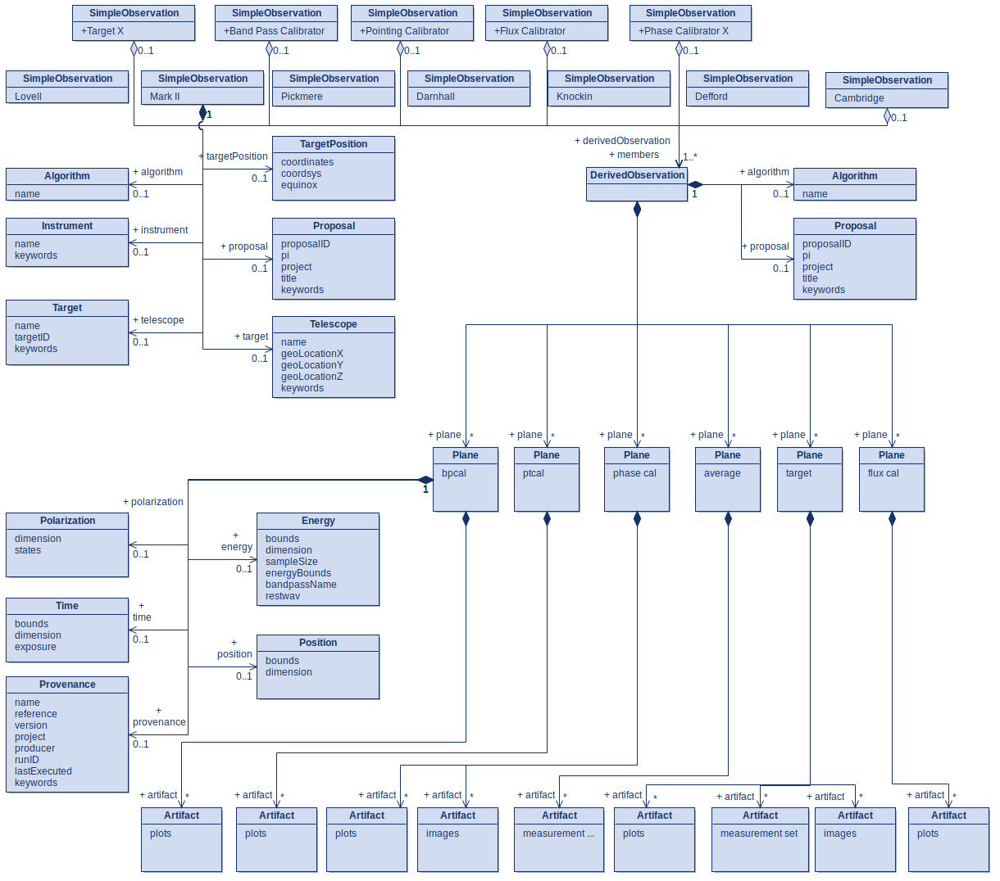

# emerlin2caom

Code to import [e-MERLIN](https://www.e-merlin.ac.uk) [pipeline](https://github.com/e-merlin/eMERLIN_CASA_pipeline) products into the [CAOM](https://github.com/opencadc/caom2)

This has been created from the blank2caom2 template

## Description

The codebase takes the output directory of the emerlin casa pipeline as an input, extracts the relevant metadata to an
xml file.
The inputs to the code are added via the settings_file.py file. These inputs are:
- storage_name: path to the target emerlin pipeline output (string)
- xmldir: directory where the output xml file will be created
- upload: True or False, if False the upload to local database will not be attempted. 
- replace_old_data: True or False, if False the old data will not be deleted and duplicate data may be inserted.
- base_url: the url of your database. 
- rootca: path to your rootCA.pem or rootCA.crt file (string)

Only storage_name and xmldir are required for xml creation. rootca may be needed for upload to the database.

See the [archive-service GitHub](https://github.com/uksrc/archive-service) to fire up your local database instance! 

## Installation and running

### Step 1. Create and initialise a conda environment
```
conda create -n emerlin2caom python
conda activate emerlin2caom
```

### Step 2. Install CADC requirements
All of the requirements with releases on the PYPI hub will be installed when installing the emerlin2caom package.
However, there are also three packages which require a separate installation method:

[cadcutils](https://github.com/opencadc/cadctools/tree/main/cadcutils)
[caom2tools](https://github.com/opencadc/caom2tools/tree/CAOM25)
[casatools](https://pypi.org/project/casatools/)

Download the github repositories [cadcutils](https://github.com/opencadc/cadctools/tree/main/cadcutils) and 
[caom2tools](https://github.com/opencadc/caom2tools/tree/CAOM25), change directories to each of their respective download 
locations and install via the following command.

### Step 3. Install emerlin2caom2

Change directory to the base emerlin2caom directory, e.g.:

```commandline
cd ~/emerlin2caom/
```

Install the emerlin2caom package and its other requirements.

```
pip install -e . 
```

Once the settings file is filled in, the code can be run using the run_script.py as follows:

```commandline
run-emerlin
```

This run command is invariant of its run location and the settings file can be updated without the need to reinstall the 
package. 

Whilst the archive service is not required for the creation of the XML documents, it is needed to build the database and upload the data to 
the repository (itself). 
For attempting upload, [Stephen's Quarkus API](https://github.com/uksrc/archive-services) should be built and running. 


There is a simple test included in "test.py", the xml should be produced but the upload is expected to return a 403 
permission denied with the current repository setup. 
Change the input values within the file as necessary


The expected output is a series of xml files which describes the metadata of the avg.ms, splits target .ms, plots (found in weblog/plot),
and fits images (found in weblog/images). The main output is the derived observation which is named according to your 
input e-Merlin data, this contains the majority of the metadata. There are also additional xml files which are simple 
observations and describe the telescopes used within the observation, each is named as with the main output, but will an 
additional tag which indicates the telescope that is modelled (Scroll down for schema diagram). 

Objects that are included within the emerlin output but not the metadata currently are:
- calibration measurement sets (found in weblog/calib),
- input files default_params.json and inputs.ini
- log files from casa and the emerlin pipeline
- the eMERLIN_CASA_pipeline codebase
- observatory.flags
- _avg.ms.flagversions measurement sets
- all html files found within weblog, as well as logs and the emerlin gif


## Alternative installation of  CASA

The casa source is here
https://open-bitbucket.nrao.edu/projects/CASA/repos/casa6/browse

can install wheels from https://casa-pip.nrao.edu/repository/pypi-casa-release/

pip install casatools --extra-index-url https://casa-pip.nrao.edu/repository/pypi-casa-release/

## Unit Tests

Initial unit tests for the e-MERLIN metadata generation code are located as a test module in /tests.
Tests can be run from the main directory whilst in your conda environment with the command:
```
python -m pytest
```
The unit tests do not currently include mock measurement sets as there were some issues with it being recognised by the python casa module. The best solution is likely to include some small section of a measurement set which can still be read by the code.

## Diagram for CAOM mapping for e-MERLIN


